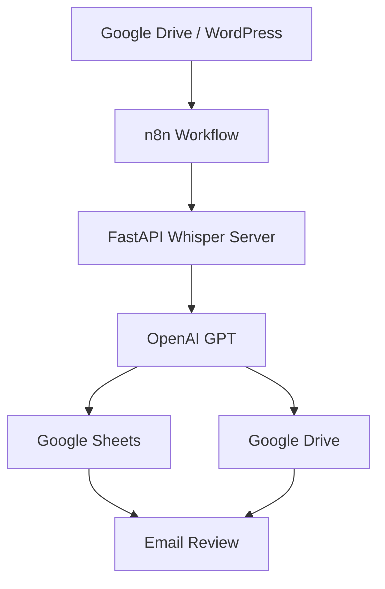
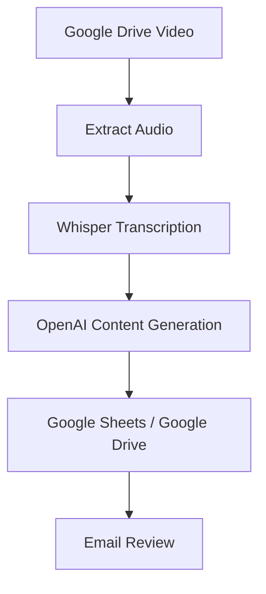
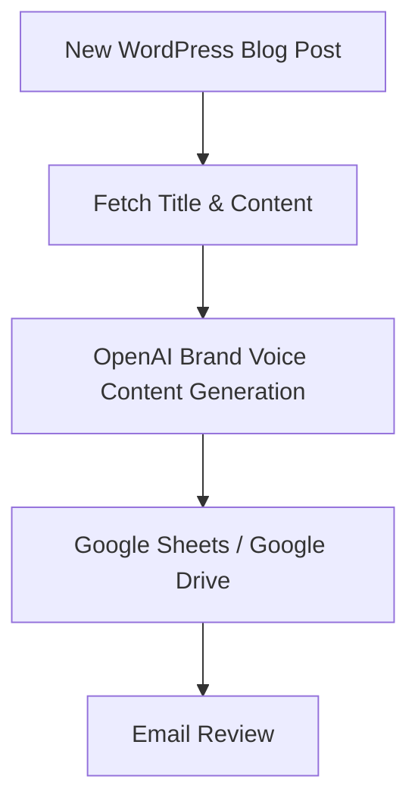

# 🚀 AI-Powered Podcast & WordPress Content Automation

An **end-to-end AI automation system** built with **n8n**, **FastAPI**, **OpenAI Whisper**, and **OpenAI GPT** to automate podcast transcription and WordPress content repurposing. This project streamlines content creation by generating platform-specific marketing assets and storing them in Google Sheets and Google Drive for **human review before publication**.

---

## 🎥 Demo Video

A complete workflow walkthrough video is included in this repository:

📹 **Workflow Demo:** `assets/Videos/Workflow-Video.mp4`

---

## 📸 Project Proof

### 🎙️ Podcast Workflow

<p align="center">
  
</p>

### 📊 Podcast Workflow Output

<p align="center">
  
</p>

### 📧 Human Review Email

<p align="center">
  
</p>

### 🌐 WordPress Blog Automation

<p align="center">
  
</p>

---

## ✨ Key Features

### 🎙️ Podcast Automation

* 📂 Detects new podcast videos uploaded to **Google Drive**
* 🎧 Extracts audio from video files
* 📝 Transcribes audio using **OpenAI Whisper** via a FastAPI backend
* 🤖 Generates AI-powered marketing assets:

  * Episode Title
  * Show Notes
  * Blog Draft
  * Facebook Caption
  * Instagram Caption
  * TikTok Script
  * Quote Ideas
  * Newsletter Copy
  * Suggested Short-form Clip Timestamps
* 🔒 Prevents duplicate processing by renaming completed files with a `done_` prefix

### 🌐 WordPress Blog Automation

* 📡 Detects newly published **WordPress blog posts**
* 📖 Pulls the blog title and content via the **WordPress REST API**
* 🎨 Generates brand-aligned content for:

  * Facebook Caption
  * Instagram Caption
  * TikTok Talking-Head Prompt
  * Email Newsletter Blurb
  * Three Short Video Hooks
  * Three Quote Graphic Ideas
  * One Soft Call-to-Action
* 📊 Saves generated content to **Google Sheets**
* ☁️ Stores outputs in **Google Drive**
* 📧 Sends content via email for **human review before public use**

---

## 💼 Business Impact

This automation system was designed to reduce the manual workload involved in podcast and blog content marketing. By combining AI transcription, content generation, and workflow automation, the project enables businesses to:

* ⏱️ Save significant time on repetitive content creation tasks
* 🔄 Repurpose long-form content into multiple marketing assets automatically
* 🎯 Maintain consistent brand voice across platforms
* 📂 Organize generated content in Google Sheets and Google Drive
* 👀 Ensure human review before public publication
* 🔒 Prevent duplicate processing of podcast files through built-in safeguards

---

## 🛠️ Tech Stack

| Category             | Technology                                              |
| -------------------- | ------------------------------------------------------- |
| **Backend**          | Python 3.14+, FastAPI, Uvicorn                          |
| **AI**               | OpenAI GPT, OpenAI Whisper, Faster-Whisper              |
| **Automation**       | n8n                                                     |
| **Package Manager**  | uv                                                      |
| **Containerization** | Docker                                                  |
| **Media Processing** | FFmpeg                                                  |
| **Integrations**     | Google Drive API, Google Sheets API, WordPress REST API |

---

## 📁 Project Structure

```bash
AI-Powered-Podcast-WordPress-Content-Automation/
├── assets/
│   ├── images/
│   └── Videos/
│       └── Workflow-Video.mp4
├── n8n-workflows/
│   ├── SLE Blog to Social Content Agent.json
│   └── Video to Audio to Transcript.json
├── whisper-server/
│   └── main.py
├── pyproject.toml
├── uv.lock
├── README.md
└── .gitignore
```

---

## 🏗️ System Architecture



---

## ⚡ Installation Using uv

### 📋 Prerequisites

Ensure the following tools are installed on your system:

* 🐍 **Python 3.14+**
* 📦 **uv package manager**
* 🎞️ **FFmpeg**
* 🐳 **Docker** (for running n8n locally)

### 📥 Clone the Repository

```bash
git clone https://github.com/your-username/AI-Powered-Podcast-WordPress-Content-Automation.git
cd AI-Powered-Podcast-WordPress-Content-Automation
```

### 📦 Install Dependencies

This project uses **uv** for dependency management. Install all dependencies with:

```bash
uv sync
```

### ▶️ Run the FastAPI Whisper Server

From the project root directory, run:

```bash
uv run --directory whisper-server uvicorn main:app --reload
```

The server will be available at:

```
http://127.0.0.1:8000
```

---

## 🔧 Environment Variables

Create a `.env` file in the project root and add the following variables:

```env
OPENAI_API_KEY=your_openai_api_key
GOOGLE_DRIVE_CREDENTIALS=path_to_credentials.json
GOOGLE_SHEETS_CREDENTIALS=path_to_credentials.json
```

---

## ☁️ Google Cloud Setup

To enable **Google Drive** and **Google Sheets** integrations:

1. Create a **Google Cloud Project**
2. Enable the **Google Drive API**
3. Enable the **Google Sheets API**
4. Generate **OAuth2** or **Service Account credentials**
5. Configure the credentials in **n8n**

---

## 🐳 Running n8n with Docker

Start n8n locally using Docker:

```bash
docker run -it --rm \
  --name n8n \
  -p 5678:5678 \
  -v n8n_data:/home/node/.n8n \
  docker.n8n.io/n8nio/n8n
```

Open n8n in your browser:

```
http://localhost:5678
```

Import the workflow files from the `n8n-workflows/` directory.

---

## 🔄 Workflow Overview

### 🎙️ Podcast Workflow



### 🌐 WordPress Workflow



---

## 🔒 Duplicate Protection

The podcast workflow includes **built-in duplicate protection**. After a video is successfully processed, the original file is automatically renamed by adding the `done_` prefix.

**Example:**

```bash
SLE SNF POD.mp4  →  done_SLE SNF POD.mp4
```

During future scheduled runs, any file starting with `done_` is skipped, ensuring the same podcast is **never transcribed or processed twice**.

---

## 👀 Human Review Process

All AI-generated content is sent for **human review** before any public publication. The workflow does **not** automatically publish content to social media or WordPress, ensuring a final quality-control checkpoint.

---

## 🔒 Security Considerations

* API keys are stored securely in environment variables.
* Google Cloud credentials are excluded from version control using `.gitignore`.
* No sensitive credentials are hardcoded in the repository.
* Human review is required before any public publication.

---

## 🚀 Future Improvements

* Add retry logic for failed workflow executions
* Implement workflow monitoring and logging
* Add automatic social media publishing after approval
* Support multiple brand voice profiles
* Add analytics tracking for generated content performance

---

## 📜 License

This project is licensed under the **MIT License**. See the [LICENSE](LICENSE) file for more details.

---

## 👨‍💻 Author

**Md. Monirul Islam**

AI Automation Engineer | Python Developer | n8n Workflow Specialist

🔗 **LinkedIn:** https://linkedin.com/in/moonirul
💻 **GitHub:** https://github.com/moonirul

---

⭐ If you found this project useful, consider giving it a **star** on GitHub!
